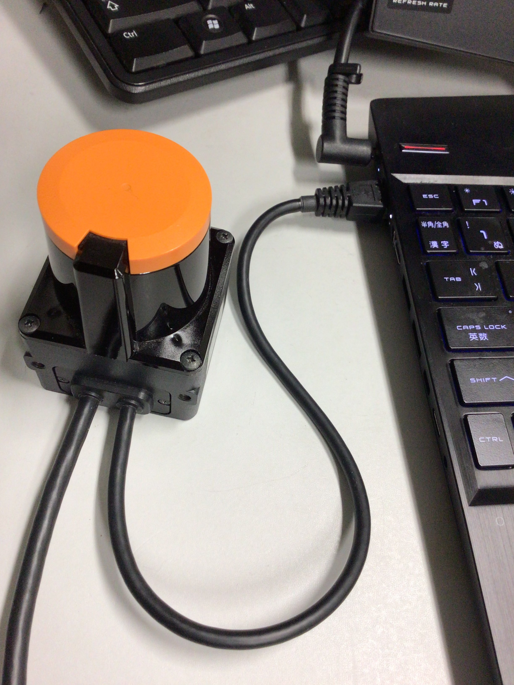
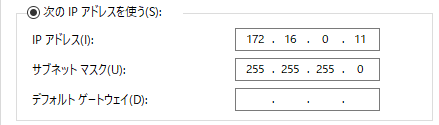
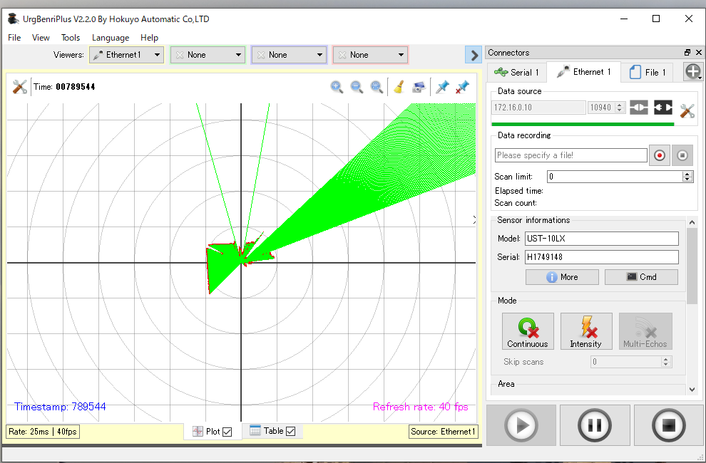
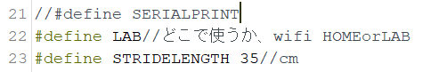
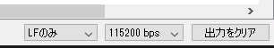
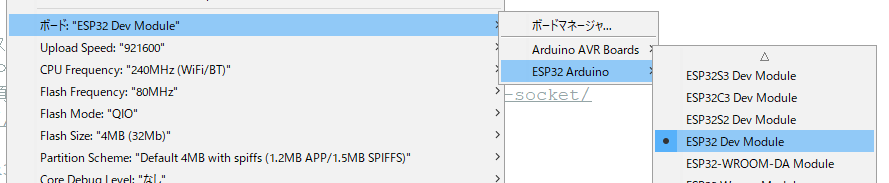
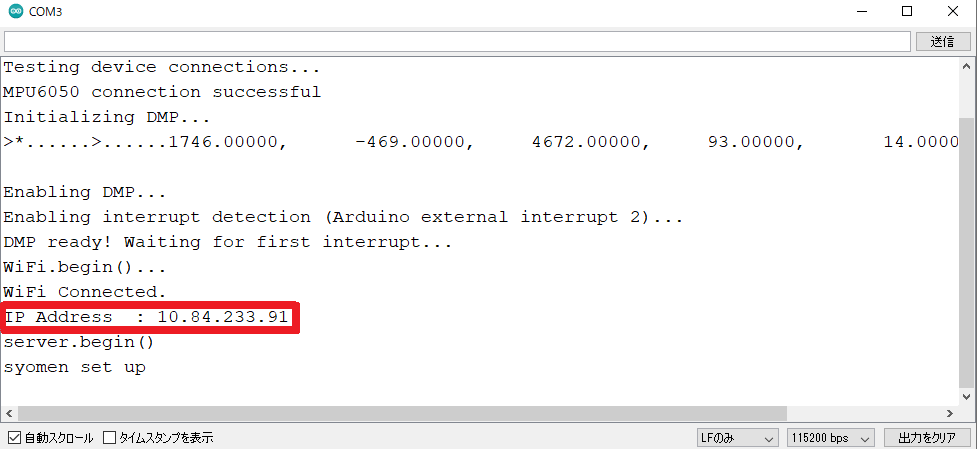
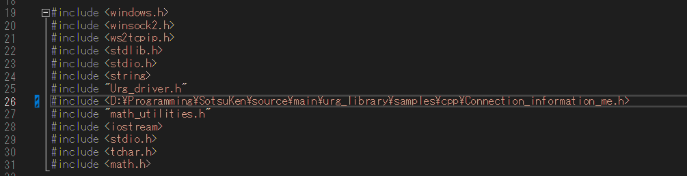
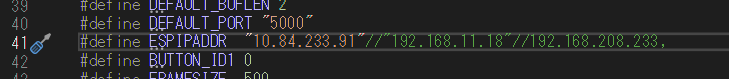

# 卒業研究チュートリアル

## はじめに

### インストールするもの
#### アプリ
- [x] [ Arduino IDE](https://www.arduino.cc/en/software)
- [x]  [Visual Studio 2017](https://visualstudio.microsoft.com/ja/#vs-section)
- [ ] [UrgBenri](https://sourceforge.net/projects/urgbenri/)

#### その他
- [ ] [ESP32 環境構築](https://interface.cqpub.co.jp/esp32-arduino-ide-2/)

### ブックマーク推奨
- [ ] [LRF製品ページ](https://www.hokuyo-aut.co.jp/search/single.php?serial=16)
- [ ] [LRF取説](https://sourceforge.net/p/urgnetwork/wiki/top_jp/)

### ライブラリー関係
- [ ] [I2CdevとMPU6050](https://github.com/jrowberg/i2cdevlib/archive/master.zip)
> 1. Download the i2cdevlib project  
> 2. Unzip the downloaded file.
> 3. Select Sketch > Include Libraries > Add .ZIP Library from the Arduino IDE's menus.
> 4. Select the "Arduino/I2Cdev" subfolder of the unzipped folder.
> 5. Click the Open button.  
> 
> - フォルダーパス `\Arduino\I2Cdev`, `\Arduino\MPU6050`


## やってみよう

### LRF編
周りが見える凄いレーダーみたいなやつ
1. LRFをPCにぶっ刺す(有線LAN or 太ったUSB接続)
> 
2. IPアドレスの設定[^1]
> IPアドレス:`172.16.0.11`  
> サブネット マスク:`255.255.255.0`  
> 
3. UrgBenri起動
> IPアドレス:`172.16.0.10`  
>   

[^1]: 参考:[IPアドレスの設定(Windows)](https://sourceforge.net/p/urgnetwork/wiki/ip_address_jp/)

### PDRベルト編
歩幅(規定値)と歩数と角度で位置推定を行うらしい

1. ベルトの基盤をPCに刺す！
> 
2. 書き込むプログラムを起動!
> `\source\main\myArduino\myESP-socketconnection-4-1020\myESP-socketconnection-4-1020.ino`
3. 22行目(?)LABになってるか確認！
>   

4. 記載されてるWi-FiにPCを繋げる！ 
> 
5. シリアルモニター起動！
>   
6. Arduinoに書き込む！
>   
7. 表示されるIPアドレスをメモ！
> 

### 運用編

1. Visual Studioで`source\main\urg_library\vs2017\cpp\urg_cpp.sln`を起動！
2. 26行目の絶対パスを書き換える
>    
```cpp
#include <D:\Programming\SotsuKen\source\main\urg_library\samples\cpp\Connection_information_me.h>
```
3. 41行目をさっきメモったIPアドレスに書き換える
>   
```cpp
#define ESPIPADDR  "10.84.233.91"//"192.168.11.18"//192.168.208.233, 
```